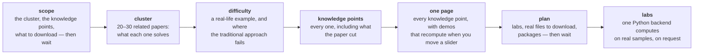

# paper-reading

A report should show that you understand a paper, not that you can read its slides aloud.

paper-reading is a Claude Code plugin with three skills. `reading` reads a paper together with the cluster of papers around it and puts every knowledge point on one interactive page. `annotate` gives the one paper you are reading a bilingual, paragraph-by-paragraph annotated page. `presentation` turns that material into a locally run teaching application with a real backend, real data and real labs.

It exists because one paper is never enough to understand one paper. A paper assumes you already know the background and starts from the back. It skips the traditional approach it improves on, and it cuts derivations to fit the page limit. A report built from that paper alone inherits every one of those gaps.

## Install

```
git clone https://github.com/linchen1107/skill_paper-reading.git ~/.claude/skills/paper-reading
```

Restart Claude Code afterwards. The plugin loads as `paper-reading@skills-dir`; `claude plugin list` confirms it. Nothing else is installed. On Windows the target is `C:\Users\<you>\.claude\skills\paper-reading`.

It reads papers as text and looks only at their figures, and runs on Sonnet, so a whole run fits a small plan.

## Update

```
git -C ~/.claude/skills/paper-reading pull
```

## Uninstall

Delete `~/.claude/skills/paper-reading`. Output folders under `~/Documents/claude/paper-reading/` are yours and are left in place.

## Use

```
/paper-reading:reading        give it a paper: a PDF, an arXiv link or a title
/paper-reading:annotate       the same paper, read closely: English, Chinese and notes side by side
/paper-reading:presentation   after reading, when you need to present it
```

Both also trigger on their own when you hand Claude a paper or say you have to present one.

## The pipeline



The first five stages are `reading`; the output is in Traditional Chinese. The last two are `presentation`; the output is in English. Each skill stops once, before any work starts, and waits for your approval.

Every claim carries one of three labels: reported by the paper, reproduced in this run, or an inference still to be verified. A demo result never stands in for the paper's result.

## What lives where

```
paper-reading/
├── .claude-plugin/plugin.json      the plugin manifest
├── skills/reading/SKILL.md         paper cluster → knowledge points → one interactive page
├── skills/reading/references/      sources.md: the requirements behind every rule, quoted
├── skills/annotate/SKILL.md        one paper → bilingual annotated page with its argument laid out
├── skills/presentation/SKILL.md    real samples + one Python backend → lab page
├── scripts/                        fetch and extract papers, find figures, check the page
└── templates/                      the page and the shared widgets every run starts from
```

Output goes to `~/Documents/claude/paper-reading/<topic>/`: the annotated page is `<topic>/annotated.html`, and the lab page with its backend goes in `<topic>/studio/`. Everything a run produces stays in that folder; by-products sit in `_work/`, which you can delete without breaking the results. No skill downloads, installs or starts a server without asking first.
